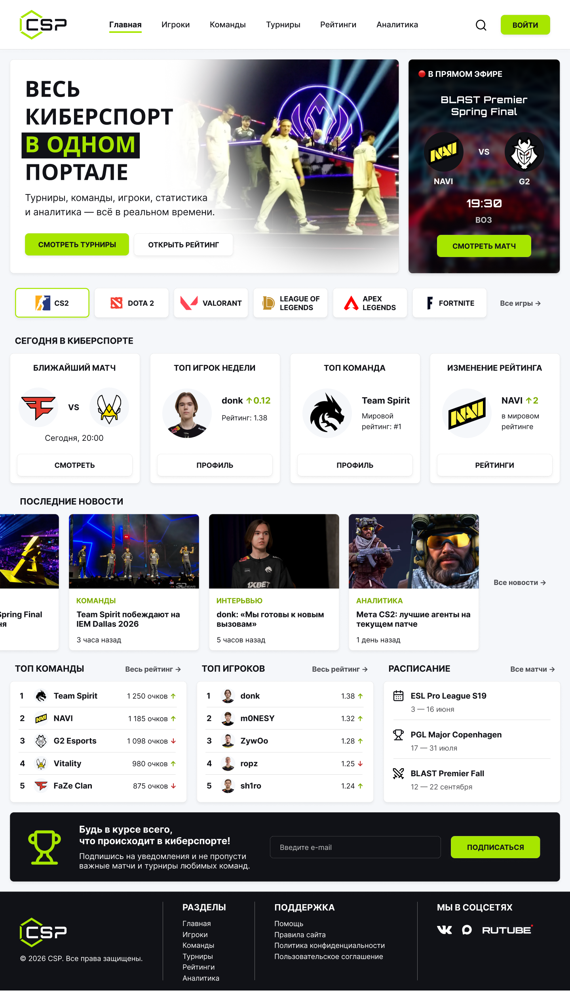

# Задание 2: UI/UX

## Описание

В рамках задания разработан UI/UX-концепт главной страницы киберспортивного портала **Cyber Sports Portal**.

## Ответственные

**Makers:**
- Николай Князев

**Checkers:**
- Юлия Мазур

## Артефакты

- [Макет в Figma](https://vk.com/away.php?to=https%3A%2F%2Fwww.figma.com%2Fdesign%2FmHt8tMZ2j0vcuS8yh3qHIn%2FCyber-Sports-Portal%3Fnode-id%3D0-1%26t%3D2R2AFRTHvqw3IfNt-1&utf=1)

## Предпросмотр

## Что отражено в макете

1. Главная страница киберспортивного портала.
2. Навигация по основным разделам: игроки, команды, турниры, рейтинги и аналитика.
3. Блок текущего live-матча с командами, временем и кнопкой перехода.
4. Раздел с популярными игровыми дисциплинами.
5. Карточки последних новостей.
6. Рейтинги команд и игроков.
7. Расписание ближайших турниров.
8. Форма подписки на обновления.
9. Светлая и тёмная темы интерфейса.
10. Базовая айдентика Cyber Sports Portal.