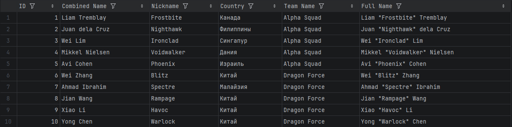
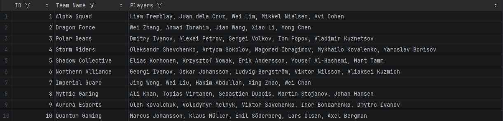

# Задание 4: Java

## Описание
В рамках задания в код были внесены доработки и исправления, а так же разработан новый функционал для формирования отчета по командам в виде CSV файла.
(JDK версии 17)

## Ответственные

**Makers:**
- Юлия Мазур

**Checkers:**
- Ольга Давыдова и Никита Акимов

## Что реализовано

1. Добавлено новое вычисляемое поле fullName в отчет по игрокам.
2. Исправлено табличное представление отчета по игрокам в соответствии с заданием.
3. Реализован новый функционал для формирования отчета по командам.
4. Так же исправлены ошибки в коде для успешного запуска.

## Предпросмотр

CSV-отчет по игрокам

*Полный отчет см. [player_report.csv](player_report.csv)*

CSV-отчет по командам

*Полный отчет см. [team_report.csv](team_report.csv)*

