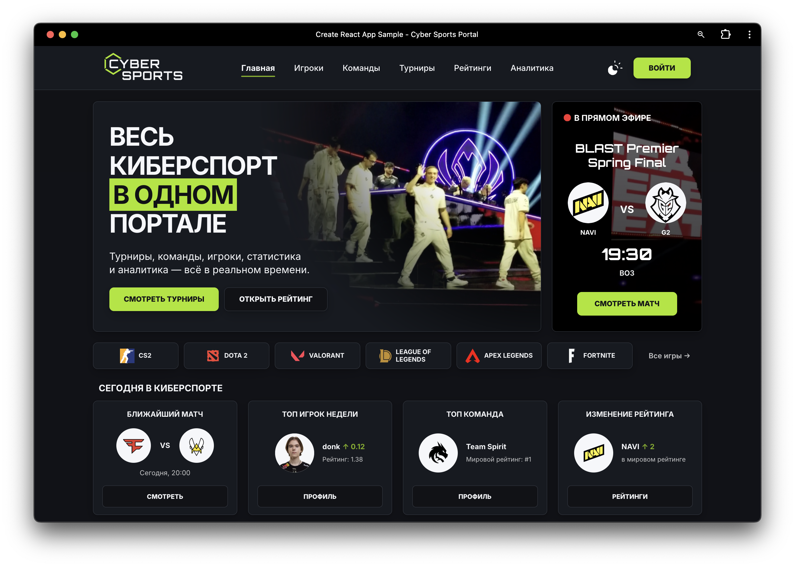

# Задание 6: JavaScript

## Описание

Реализована главная страница киберспортивного портала Cyber Sports Portal по подготовленному UI/UX-макету.

На странице представлены:

- светлая и тёмная темы;
- главный информационный баннер и карточка текущего матча;
- список игровых дисциплин;
- новостной блок;
- рейтинги команд и игроков;
- расписание турниров;
- текущие дата и время;
- интерактивные состояния и CSS-анимации.

Интерфейс реализован на React и TypeScript. Для компоновки элементов используются Flexbox и CSS Grid. Компоненты имеют осмысленные названия и разделены по назначению.

## Ответственные

**Makers:**
- Егор Базакин
- Николай Князев

**Checkers:**
- Николай Князев
- Егор Базакин

## Предпросмотр

